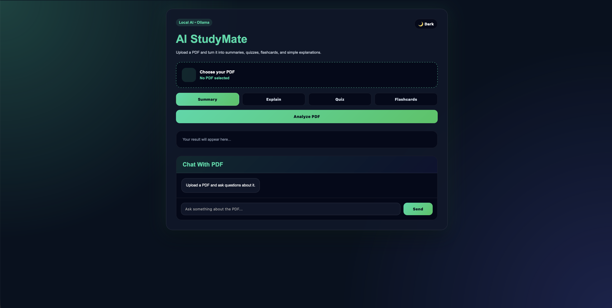
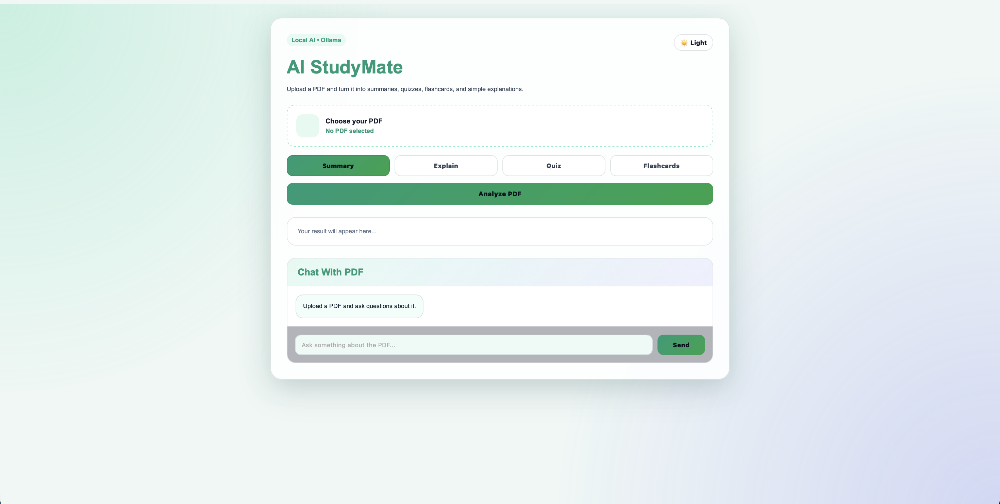
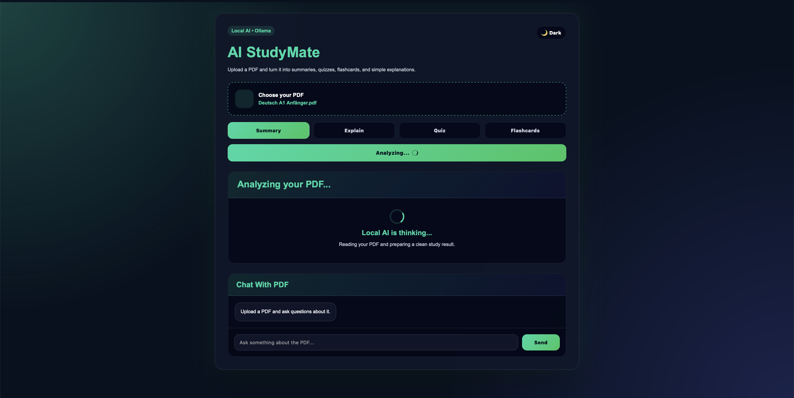
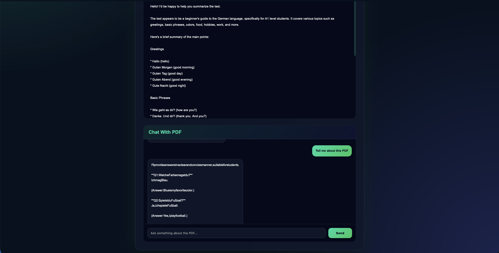

# AI StudyMate 

Modern AI PDF Study Assistant built with:

- FastAPI
- Python
- HTML
- CSS
- JavaScript
- Ollama Local AI
- Glassmorphism UI

---

# Features 

- PDF Upload
- AI Summarization
- AI Flashcards
- AI Quiz Generator
- AI Concept Explanation
- Chat with PDF
- Dark / Light Mode
- Modern UI
- Typing Animation
- Custom Alerts
- Animated Loader

---

# Screenshots 

## Main UI

## Main UI










## 1. Clone Repository

```bash
git clone https://github.com/baseetnaseri6/AI-StudyMate.git
```

## 2. Open Project

```bash
cd AI-StudyMate
```

## 3. Create Virtual Environment

```bash
cd backend
python3 -m venv venv
```

## 4. Activate Environment

```bash
source venv/bin/activate
```

## 5. Install Requirements

```bash
pip install fastapi uvicorn pymupdf python-multipart requests ollama
```

## 6. Install Ollama

Download:
https://ollama.com/download/mac

Then install model:

```bash
ollama pull llama3.2
```

## 7. Run Backend

```bash
python -m uvicorn main:app --reload
```

Backend runs on:

```text
http://127.0.0.1:8000
```

## 8. Run Frontend

Open frontend/index.html with Live Server.

---

# Installation Guide (Windows)

## 1. Install Python

Download:
https://python.org

IMPORTANT:
Enable:

[x] Add Python to PATH

---

## 2. Install VS Code

Download:
https://code.visualstudio.com/

Install extensions:

- Python
- Live Server

---

## 3. Clone Repository

```bash
git clone https://github.com/YOUR_USERNAME/AI-StudyMate.git
```

---

## 4. Create Virtual Environment

```bash
cd backend
python -m venv venv
```

---

## 5. Activate Environment

```bash
venv\Scripts\activate
```

---

## 6. Install Requirements

```bash
pip install fastapi uvicorn pymupdf python-multipart requests ollama
```

---

## 7. Install Ollama

Download:
https://ollama.com/download/windows

Install model:

```bash
ollama pull llama3.2
```

---

## 8. Run Backend

```bash
python -m uvicorn main:app --reload
```

---

## 9. Run Frontend

Open `frontend/index.html` with Live Server.

---

# Folder Structure 

```text
AI-StudyMate
│
├── backend
│   ├── main.py
│   ├── ai_service.py
│   ├── pdf_service.py
│   ├── uploads
│   └── venv
│
├── frontend
│   ├── index.html
│   ├── style.css
│   └── app.js
│
└── README.md
```

---

# Future Features 

- Voice Assistant
- AI Notes Generator
- Mindmap Generator
- User Authentication
- Cloud Deployment
- Database Integration
- Vector Database
- GPT Integration

---

# Author 

Mohammad Baseet Naseri

- Data Scientist
- AI Engineer
- Full-Stack Developer

---

# License 

MIT License
